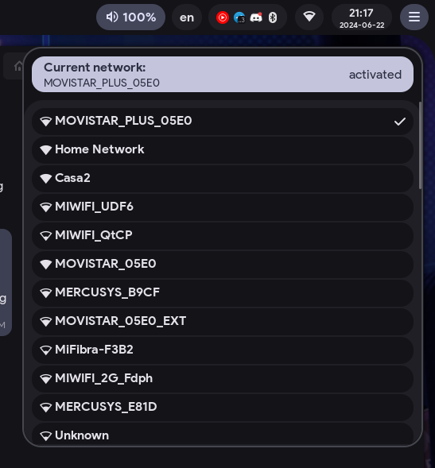

# Hyprland dotfiles

[](screenshots/screenshot1.png)

Hyprland Material You is a fork of the [ML4W](https://gitlab.com/stephan-raabe/dotfiles/-/tree/2.9.1) dotfiles. It aims to provide a modern, feature-rich, and visually appealing desktop configuration.
Here are some key features:

- **Autogenerated Colors**: The project generates colors based on your wallpaper using Material colors.
- **Fluid Animations**: Expect natural and fluid animations throughout the desktop experience.
- **Design**: The design wherever possible is made by [Material 3 design](https://m3.material.io/).

## To install

```sh
sudo pacman -Syu
sudo pacman -S git
cd ~
git clone https://github.com/MrDanikYT-pixel/hyprland-material-you.git
mv hyprland-material-you dotfiles
cd dotfiles
./install.sh
```

**Recommended icons:** [Tela nord](https://www.gnome-look.org/p/1279924/) or [Tela circle nord](https://www.gnome-look.org/p/1359276/)

> I'm not sure if it will work, if you have any problems installing it, post in Issues

## Screenshots

-------

- Sidebar
  
[](screenshots/sidebar.png) [](screenshots/sidebar-system.png)

- Wifi
  
[](screenshots/wifi.png)

- Player
  
[](screenshots/player.png)

- Apps
  
[](screenshots/apps-menu.png)

- Gtk theme:
  
[](screenshots/gtk-theme.png)
[](screenshots/light-theme.png)
