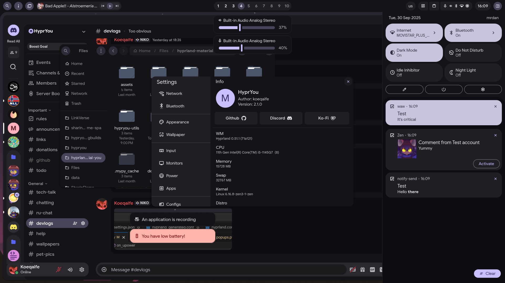

# HyprYou

HyprYou (hyprland-material-you v2). It aims to provide a modern, feature-rich, and visually appealing desktop configuration. Here are some key features:

- **Material You Colors**: The project generates colors for your apps based on you wallpapers or settings.
- **Fluid Animations**: Expect natural and fluid animations throughout the desktop experience.
- **Design**: The design wherever possible is made by [Material 3 design](https://m3.material.io/)

> [!NOTE]
> I'm doing everything by myself and **for free**.  
> If you want to support me, you can buy me a coffee on [**ko-fi**](https://ko-fi.com/koeqaife).

> [!NOTE]
> If you want to talk or to check devlogs go to our Discord server  
> <https://discord.gg/nCK3sh8mNU>

## How to install

    
Manual installation

- Clone repository: `git clone --depth=1 https://github.com/koeqaife/hyprland-material-you.git`
- Install all dependencies from depends.txt
- Build Cython code by using `build.sh` in `hypryou/`
- Then copy `hypryou` to `/usr/lib/hypryou` and copy `hypryou-assets` to `/usr/share/hypryou`
- Then use `build.sh` in `build`
- Move `hypryouctl`, `hypryou-start`, `hypryou-crash-dialog` to `/usr/bin`
- Copy `assets/hypryou.desktop` to `/usr/share/wayland-sessions/`
- And run it as `HyprYou` from your window manager (Not `Hyprland`!!)
- Optional:
  - You can build `hypryou-utils` or `hypryou-greeter` if you want  
    > By using `makepkg -si` in `greeter` for `hypryou-greeter` or in `hypryou-utils`

    
Automatic installation (Arch)

- `hypryou` - Use `makepkg -si`
- `hypryou-greeter` - Use `makepkg -si` in `greeter/`
- `hypryou-utils` - Use `makepkg -si` in `hypryou-utils/`

## Thanks to

- All people from my discord server
- All Sponsors (I love y'all!)
- [Astal](https://github.com/Aylur/astal): For Bluetooth and WirePlumber services
- [Gtk4LayerShell](https://github.com/wmww/gtk4-layer-shell): For LayerShell
- [Hyprland](https://github.com/hyprwm/Hyprland): For the best TWM I've ever seen
- Maybe that's it

## Note

> Just wanted to say. This project is crazy ngl. Why did I even choose to wrote it on gtk4 😭  
> I tried to make menu in tray... I couldn't... Sorry.....  
> I really hope everyone will like it, I spent 2 months for it, holy moly!  
> And now, it's time to release it, I'm so tired........
