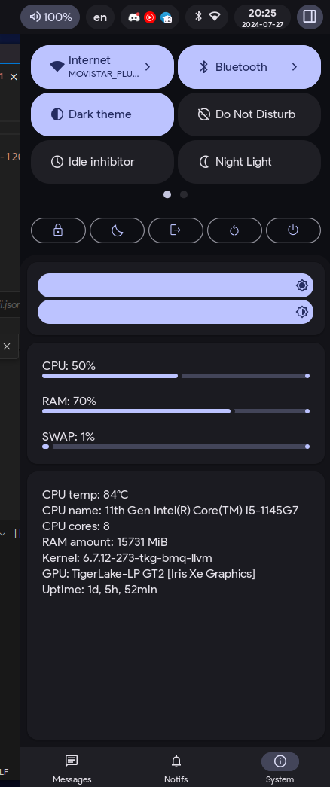
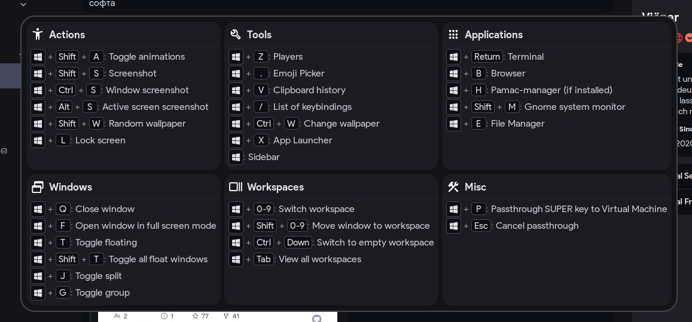

# Hyprland dotfiles

[](screenshots/screenshot1.png)

Hyprland Material You. It aims to provide a modern, feature-rich, and visually appealing desktop configuration.
Here are some key features:

- **Autogenerated Colors**: The project generates colors based on your wallpaper using Material colors.
- **Fluid Animations**: Expect natural and fluid animations throughout the desktop experience.
- **Design**: The design wherever possible is made by [Material 3 design](https://m3.material.io/) (or Material You).
- **Ripple effect**: There is a ripple effect on almost all of the buttons on the interface

Discord: https://discord.gg/nCK3sh8mNU

## To install

```sh
sudo pacman -Syu
sudo pacman -S git
cd ~
git clone https://github.com/koeqaife/hyprland-material-you.git
mv hyprland-material-you dotfiles
cd dotfiles
./install.sh
```

> I'm not sure if it will work, if you have any problems installing it, post in Issues

<details> 
  <summary>Support</summary>

  If you can support me please :3
  [DonationAlerts](https://www.donationalerts.com/r/koeqaife)
</details>

## Screenshots

- Sidebar
  
[](screenshots/sidebar.png)[](screenshots/sidebar-system.png)

- Settings
  
[](screenshots/settings.png)

- Player
  
[](screenshots/player.png)

- Apps
  
[](screenshots/apps-menu.png)

- Lock Screen (hyprlock)

[](screenshots/hyprlock.png)

- Gtk theme:
  
[](screenshots/gtk-theme.png)
[](screenshots/light-theme.png)

- List of keybindings

[](screenshots/cheatsheet.png)

- Emoji picker

[](screenshots/emoji.png)

- Left sidebar

[](screenshots/sideleft.png)

> I got some code for AGS from [end-4](https://github.com/end-4/dots-hyprland/) and [kotontrion](https://github.com/kotontrion/dotfiles) configs, thanks to them.
